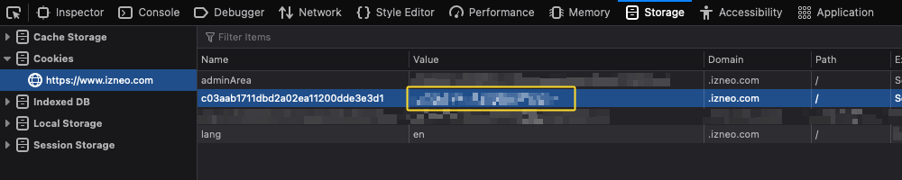

# izneo-get

You can use this script to get any comics that are available in your [izneo](https://izneo.com/) account.

Then you can read them on devices that are not supported by the izneo reader or apps.

Note that you should delete any comics that you have finished reading, and you should not keep any comics that you are not allowed to read.

1. [izneo-get](#izneo-get)
   1. [Installing](#installing)
      1. [Requirements](#requirements)
      2. [Steps to install the scripts](#steps-to-install-the-scripts)
   2. [Configuration](#configuration)
      1. [Using Chrome or Chromium-based browsers](#using-chrome-or-chromium-based-browsers)
      2. [Using Firefox or Firefox-based browsers](#using-firefox-or-firefox-based-browsers)
   3. [Steps to run the script(s)](#steps-to-run-the-scripts)
   4. [izneo_list.py](#izneo_listpy)
      1. [Using izneo_list.py](#using-izneo_listpy)
      2. [Examples of using izneo-list.py](#examples-of-using-izneo-listpy)
   5. [izneo-get.py](#izneo-getpy)
      1. [Using izneo-get.py](#using-izneo-getpy)
      2. [Examples of using izneo-get.py](#examples-of-using-izneo-getpy)
   6. [Using both izneo_list.py and izneo_get.py](#using-both-izneo_listpy-and-izneo_getpy)
      1. [Examples of using both](#examples-of-using-both)

## Installing

### Requirements

- [Python 3.9+](https://www.python.org/downloads/)
- [git](https://git-scm.com/downloads)

To check if you have them, open a terminal window and run the commands below.

```bash
# For Python, either
python --version
# or
python3 --version
# For gitL
git --version
```

### Steps to install the scripts

Open a terminal window, clone this repository and go to that folder:

```bash
git clone https://github.com/izranbx/iz-dl.git && cd iz-dl
```

Create a virtual environment (optional but recommended):

```python
python -m venv env
```

or

```python
python3 -m venv env
```

Activate the virtual environment:

```python
source env/bin/activate
```

or activate the virtual environment on Windows:

```python
env\Scripts\activate
```

Upgrade and install dependencies:

```python
python -m pip install --upgrade pip
python -m pip install -r requirements.txt
```

When you're finished, leave the virtual environment:

```python
deactivate
```

## Configuration

To find the required values for authentication, you need to:

1. Duplicate the file `izneo_get.cfg.sample` and name it `izneo_get.cfg`
2. Log in to your izneo account via your browser
3. View the cookies in your browser
4. Copy the values and paste them into your config file `izneo_get.cfg`

Screenshot:



Description of the configuration variables:

value | description
--- | ---
cfduid | This is no longer required. This used to be the value of your `PHPSESSID` cookie.
session_id | This must be the value of your `c03aab1711dbd2a02ea11200dde3e3d1` cookie. See below.

### Using Chrome or Chromium-based browsers

1. Select Menu --> More Tools --> Development Tools  
2. Go to Application / Storage / Cookies  
3. Search for the cookie named `https://www.izneo.com`
4. Copy the value of your `c03aab1711dbd2a02ea11200dde3e3d1` cookie
5. Open `izneo_get.cfg` and replace the value of `session_id` with it

### Using Firefox or Firefox-based browsers

1. Go to Tools --> Browser Tools --> Web Developer Tools
2. Select the Storage tab
3. Expand the Cookies in the left-hand side bar  
4. Click the cookie named `https://www.izneo.com`
5. Open `izneo_get.cfg` and replace the value of `session_id` with it

## Steps to run the script(s)

1. Update the values in your config file
2. Open a terminal window
3. Go to the folder where you installed these scripts
4. Activate your Python virtual environment

   ```python
   source env/bin/activate
   ```

5. Run the script(s) — see examples below
6. Deactivate your Python virtual environment

   ```python
   deactivate
   ```

## izneo_list.py

### Using izneo_list.py

```bash
python izneo_list.py [-h] [--session-id SESSION_ID] [--cfduid CFDUID]
                     [--config CONFIG] [--pause PAUSE] [--full-only]
                     [--series] [--force-title]
                     search

positional arguments:
  search                search for a series or directly pass the URL of 
                        a series to generate a list of all the comics of
                        that series

optional arguments:
  -h, --help            show this help message and exit
  --session-id SESSION_ID, -s SESSION_ID
                        pass the session ID from your browser
  --cfduid CFDUID, -c CFDUID
                        pass the CFDUID if needed
  --config CONFIG       set the path to a configuration file to avoid having 
                        to pass the same parameters each time
  --pause PAUSE         set the time in seconds to wait between each image
  --full-only           ignore comics that are not available in the subscription
  --series              only search for series
  --force-title FORCED_TITLE
                        rename the files with the FORCED_TITLE instead of using
                        their original name
```

### Examples of using izneo-list.py

List the links to a comic series (assuming you have a configuration file):

```bash
python izneo_list.py https://www.izneo.com/en/manga/historical-fiction/mushishi-32275
```

Same as above and save the list as a text file:

```bash
python izneo_list.py https://www.izneo.com/en/manga/historical-fiction/mushishi-32275 > list.txt
```

List only the links that are available as part of the subscription for the specified comic series (assuming you have a configuration file):

```bash
python izneo_list.py https://www.izneo.com/en/manga/historical-fiction/mushishi-32275 --full-only
```

Search for comics:  

```bash
python izneo_list.py "mushishi"
```

Search for a comic series and list the links (assuming you have a configuration file):

```bash
python izneo_list.py "mushishi" --series
```

## izneo-get.py

### Using izneo-get.py

```bash
python izneo_get.py [-h] [--session-id SESSION_ID] [--cfduid CFDUID]
                    [--output-folder OUTPUT_FOLDER]
                    [--output-format {jpg,both,cbz}] [--config CONFIG]
                    [--from-page FROM_PAGE] [--limit LIMIT] [--pause PAUSE]
                    [--full-only] [--continue] [--user-agent USER_AGENT]
                    [--webp WEBP] [--tree] [--force-title FORCE_TITLE]
                    [--encoding ENCODING]
                    url

positional arguments:
  url                   pass either the URL to the comic or the path to a
                        text file that contains a list of URLs

optional arguments:
  -h, --help            show this help message and exit
  --session-id SESSION_ID, -s SESSION_ID
                        pass the session ID from your browser
  --cfduid CFDUID, -c CFDUID
                        pass the CFDUID if needed
  --output-folder OUTPUT_FOLDER, -o OUTPUT_FOLDER
                        specify the folder where files will be saved 
  --output-format {jpg,both,cbz}, -f {jpg,both,cbz}
                        specify a format for the files
  --config CONFIG       set the path to a configuration file to avoid having 
                        to pass the same parameters each time
  --from-page FROM_PAGE
                        specific the first page to get (default: 0)
  --limit LIMIT         set the maximum number of pages that you want to 
                        save (default: 1000)
  --pause PAUSE         set the time in seconds to wait between each image
  --full-only           ignore comics that are not available in the subscription
  --continue            resume where the script left and keep any existant files
  --user-agent USER_AGENT
                        set the user agent for the connection
  --webp WEBP           convert the source images to WebP using the specified 
                        quality, for example: --webp 75
  --tree                create a tree structure in the folder where it saves the
                        files
  --force-title FORCED_TITLE
                        rename the files instead of using their original name
  --encoding ENCODING   if you are using a text file with a list of URLs and 
                        running into issues, specify the encoding here, for 
                        example: "utf-8"
```

### Examples of using izneo-get.py

Get a comic (assuming you have a configuration file):

```bash
python izneo_get.py https://www.izneo.com/en/manga/historical-fiction/mushishi-32275/mushishi-1-70086
```

Get a comic as a CBZ file (assuming you have a configuration file):

```bash
python izneo_get.py https://www.izneo.com/en/manga/historical-fiction/mushishi-32275/mushishi-1-70086 -f cbz
```

Get a comic as a CBZ file with the specified name (assuming you have a configuration file):

```bash
python izneo_get.py https://www.izneo.com/en/manga/historical-fiction/mushishi-32275/mushishi-1-70086 -f cbz --force-title "[Yuki Urushibara] Mushishi - Volume 1"
```

Get a comic, convert the images to WebP, and save it as a CBZ file (assuming you have a configuration file):  

```bash
python izneo_get.py https://www.izneo.com/en/manga/historical-fiction/mushishi-32275/mushishi-1-70086 -f cbz --webp 70
```

Get comics from a list as CBZ files (assuming you have a configuration file):

```bash
python izneo_get.py list.txt -f cbz
```

Get comics from a list as CBZ files and matching the file structure on the server (assuming you have a configuration file):

```bash
python izneo_get.py list.txt -f cbz -tree
```

Get a comic without having a configuration file and passing all the parameters:

```bash
python izneo_get.py https://www.izneo.com/en/manga/historical-fiction/mushishi-32275/mushishi-1-70086 -s abcdefghijkl123456789012345 -f cbz -o /path/to/folder/izneo
```

## Using both izneo_list.py and izneo_get.py

### Examples of using both

Get all comics from a series, using a temporary list (assuming you have a configuration file):

```bash
python izneo_list.py https://www.izneo.com/en/manga/historical-fiction/mushishi-32275 > list.txt
python izneo_get.py -f cbz list.txt
```
